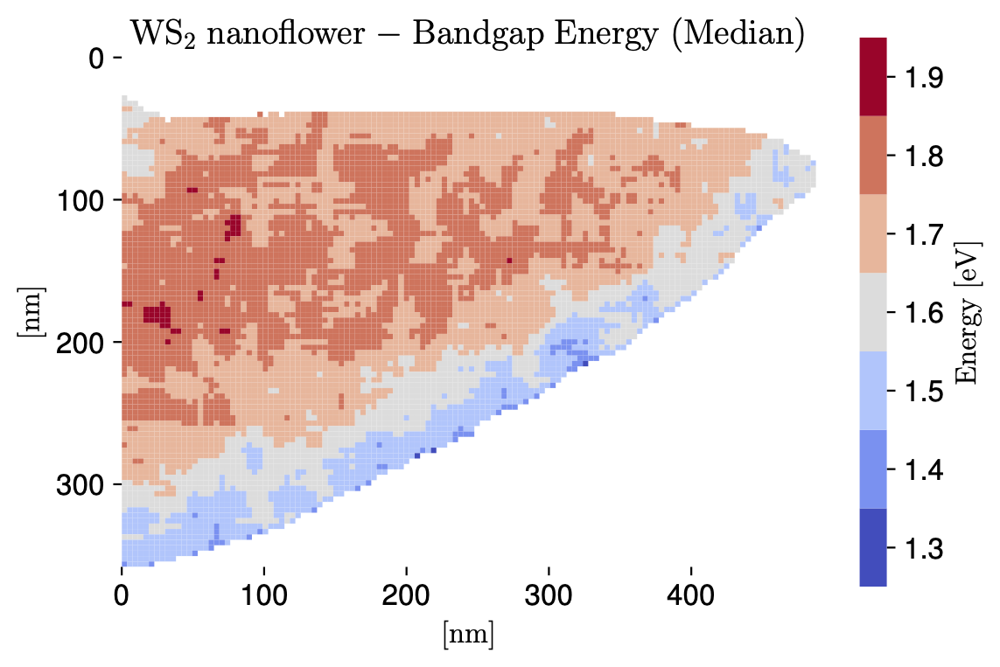

.. EELSfitter documentation master file, created by
   sphinx-quickstart on Fri Mar 19 16:49:12 2021.
   You can adapt this file completely to your liking, but it should at least
   contain the root `toctree` directive.

.. image:: ../_assets/delft_logo.jpg
     :width: 18 %
     :alt: TU Delft logo

.. image:: ../_assets/qn_logo.png
     :width: 18 %
     :alt: QN logo

Welcome to the EELSFitter website!
=======================================

EELSFitter is an open-source Python-based framework developed for the analysis and interpretation of Electron Energy Loss Spectroscopy (EELS) measurements in Transmission Electron Microscopy (TEM). EELSfitter is based on the machine learning techniques developed by the `NNPDF Collaboration <https://nnpdf.mi.infn.it>`_ in the context of applications in high energy physics, in particular feed-forward neural networks for unbiased regression in multidimensional problems.

    *Spatially-resolved map of the bandgap for the WS*\ :sub:`2`\  *nanoflower specimen, where a mask has been applied to remove the vacuum and pure substrate pixels.*

Publications
~~~~~~~~~~~~

EELSFitter has been used in the following **scientific publications**:

- *Charting the low-loss region in Electron Energy Loss Spectroscopy with machine learning*, Laurien I. Roest, Sabrya E. van Heijst, Luigi Maduro, Juan Rojo, Sonia Conesa-Boj :cite:p:`Roest2021`.
- *Illuminating the Electronic Properties of WS2 Polytypism with Electron Microscopy*, Sabrya E. van Heijst, Masaki Mukai, Eiji Okunishi, Hiroki Hashiguchi, Laurien I. Roest, Luigi Maduro, Juan Rojo, Sonia Conesa-Boj :cite:p:`vanHeijst2021`.
- *Spatially-resolved band gap and dielectric function in 2D materials from Electron Energy Loss Spectroscopy*, Abel Brokkelkamp, Jaco ter Hoeve, Isabel Postmes, Sabrya E. van Heijst, Luigi Maduro, Albert Davydov, Sergiy Krylyuk, Juan Rojo, Sonia Conesa-Boj :cite:p:`Brokkelkamp2022`.
- *Localized exciton anatomy and band gap energy modulation in 1D MoS2 nanostructures* Stijn van der Lippe, Abel Brokkelkamp, Juan Rojo, Sonia Conesa-Boj :cite:p:`vanderLippe2023`.
- *Edge-induced excitations in Bi2Te3 from spatially-resolved electron energy-gain spectroscopy*, Helena La, Abel Brokkelkamp, Stijn van der Lippe, Jaco ter Hoeve, Juan Rojo, Sonia Conesa-Boj :cite:p:`La2023`

The code from the these publications is available in the :ref:`Code<code>` section.

Team description
~~~~~~~~~~~~~~~~

The **EELSFitter collaboration** is currently composed by the following members:

- Abel Brokkelkamp, *Kavli Institiute of Nanoscience, Delft University of Technology*
- Jaco ter Hoeve, *VU Amsterdam and Nikhef Theory Group*
- Stijn van der Lippe, *Kavli Institiute of Nanoscience, Delft University of Technology*
- Juan Rojo, *VU Amsterdam and Nikhef Theory Group*
- Sonia Conesa Boj, *Kavli Institiute of Nanoscience, Delft University of Technology*

Former members of the EELSFitter project include

- Laurien Roest, Business Analyst at *Picnic*
- Isabel Postmes, Electron Optics Engineer at *ASML*
- Luigi Maduro, PostDoc at *University of Manchester*
- Helena La, Design Engineer at *ASML*

Citation policy
~~~~~~~~~~~~~~~
If you use EELSFitter in a scientific publication, please make sure to cite:

- *Charting the low-loss region in Electron Energy Loss Spectroscopy with machine learning*, Roest, Laurien I. and van Heijst, Sabrya E. and Maduro, Luigi and Rojo, Juan and Conesa-Boj, Sonia :cite:p:`Roest2021`.
- *Spatially-resolved band gap and dielectric function in 2D materials from Electron Energy Loss Spectroscopy*, Brokkelkamp, Abel, and ter Hoeve, Jaco, and Postmes, Isabel, and van Heijst, Sabrya E. and Maduro, Luigi, and Davydov, Albert, and Krylyuk, Sergiy, and Rojo, Juan and Conesa-Boj, Sonia, :cite:p:`Brokkelkamp2022`.

.. toctree::
   :maxdepth: 2
   :caption: Installation
   :hidden:

   installation/instructions
   installation/tutorial
   installation/cluster

.. toctree::
   :maxdepth: 2
   :caption: Theory
   :hidden:

   theory/clustering_pooling
   theory/nn_training
   theory/kk_analysis
   theory/band_gap_analysis

.. toctree::
   :maxdepth: 2
   :caption: Key Results
   :hidden:

   key_results/Roest2021
   key_results/vanHeijst2021
   key_results/Brokkelkamp2022
   key_results/vanderLippe2023
   key_results/La2023

.. toctree::
   :maxdepth: 2
   :caption: Code
   :hidden:

   modules/EELSFitter.rst

.. toctree::
   :maxdepth: 1
   :caption: Bibliography
   :hidden:

   bibliography.rst

Indices and tables
==================

* :ref:`genindex`
* :ref:`modindex`
* :ref:`search`

