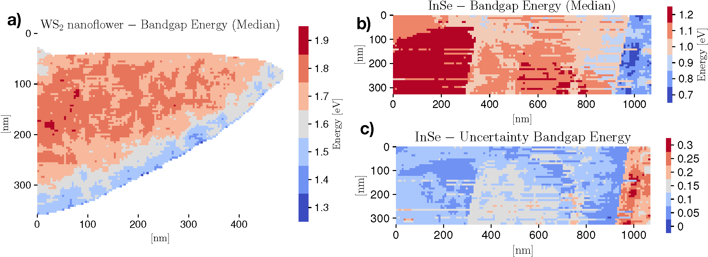

Spatially-resolved band gap and dielectric function in 2D materials from Electron Energy Loss Spectroscopy
==========================================================================================================

*This is a summary highlighting the application of EELSFitter in this publication.
For more detail about the work presented, please refer to the publication itself* :cite:p:`Brokkelkamp2022`

Abstract
--------

The electronic properties of two-dimensional (2D) materials depend sensitively on the underlying atomic
arrangement down to the monolayer level. Here we present a novel strategy for the determination of the
band gap and complex dielectric function in 2D materials achieving a spatial resolution down to a few nanometers.
This approach is based on machine learning techniques developed in particle physics and makes possible the
automated processing and interpretation of spectral images from electron energy loss spectroscopy (EELS).
Individual spectra are classified as a function of the thickness with K-means clustering, and then used to
train a deep-learning model of the zero-loss peak background. As a proof of concept we assess the band gap
and dielectric function of InSe flakes and polytypic WS\ :sub:`2`\  nanoflowers and correlate these electrical properties
with the local thickness. Our flexible approach is generalizable to other nanostructured materials and to
higher-dimensional spectroscopies and is made available as a new release of the open-source EELSfitter framework.

.. _ws2_inse_bandgaps:

    *(a) Spatially-resolved map of the bandgap for the WS*\ :sub:`2`\  *nanoflower specimen, where a
    mask has been applied to remove the vacuum and pure substrate pixels. (b,c) The median value
    of the bandgap energy* :math:`E_{bg}` *and its corresponding 68% CL relative uncertainties across the InSe
    specimen, respectively.*
