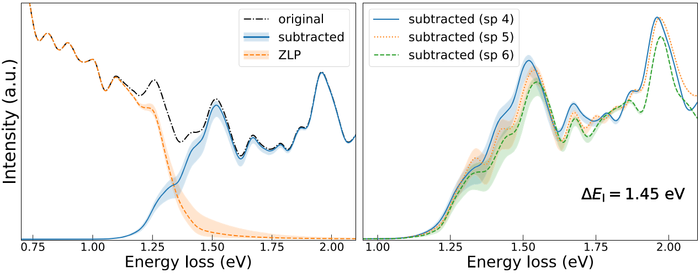

Charting the low-loss region in Electron Energy Loss Spectroscopy with machine learning
=======================================================================================

*This is a summary highlighting the application of EELSFitter in this publication.
For more detail about the work presented, please refer to the publication itself* :cite:p:`Roest2021`.

Abstract
--------

Exploiting the information provided by electron energy-loss spectroscopy (EELS) requires reliable access
to the low-loss region where the zero-loss peak (ZLP) often overwhelms the contributions associated
to inelastic scatterings off the specimen. Here we deploy machine learning techniques developed in
particle physics to realise a model-independent, multidimensional determination of the ZLP with a
faithful uncertainty estimate. This novel method is then applied to subtract the ZLP for EEL spectra
acquired in flower-like WS\ :sub:`2`\  nanostructures characterised by a 2H/3R mixed polytypism.
From the resulting subtracted spectra we determine the nature and value of the bandgap of polytypic
WS\ :sub:`2`\ , finding :math:`E_{bg} = 1.6_{−0.2}^{+0.3}` eV with a clear preference for an indirect bandgap.
Further, we demonstrate how this method enables us to robustly identify excitonic transitions down to very small
energy losses. Our approach has been implemented and made available in an open source PYTHON package dubbed EELSfitter.

.. _ws2_models_and_excitons:

    *Left: the original and subtracted EEL spectra of WS*\ :sub:`2`\  *nanostructure, together with the predictions
    of the ZLP model. The bands indicate the 68% confidence level uncertainties. Right: comparison of the
    ZLP-subtracted spectra from three locations in the WS*\ :sub:`2`\  *nanostructure together with the
    corresponding model uncertainties. Note how several features of the subtracted spectra, in particular
    the peaks at 𝛥𝐸 ≃ 1.5, 1.7 and 2.0 are eV, are common across the three locations.*
