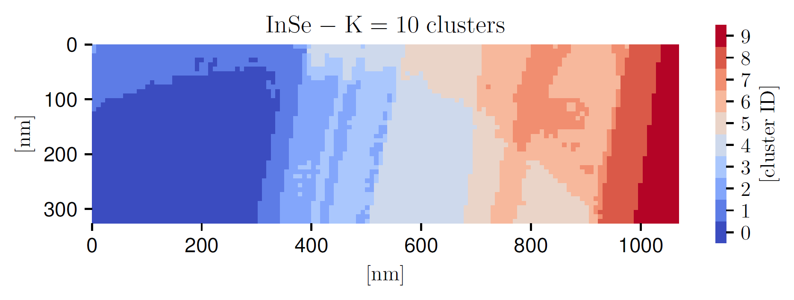

Pooling and clustering
======================

Let us consider a two-dimensional region of the analysed specimen with
dimensions :math:`L_x\times L_y` where EEL spectra are recorded for :math:`n_p=n_x \times n_y` pixels.
Then the information contained within an EELS-SI may be expressed as

.. math:: :label: eq:EELSmaster_image_app

   I^{(i,j)}_{\rm EELS}(E_\ell) \,,
   \quad i=1,\ldots, n_x\,,
   \quad j=1,\ldots, n_y\,,
   \quad  \ell=1,\ldots, n_E \, ,

With each spectra constructed as

.. math:: :label: eq:EELSmaster_image

   I^{(i,j)}_{\rm EELS}(E_\ell) =
   I^{(i,j)}_{\rm ZLP}(E_\ell) +
   I^{(i,j)}_{\rm inel}(E_\ell) \, ,

where :math:`I^{(i,j)}_{\rm EELS}(E_\ell)` indicates the recorded total
electron energy loss intensity for an energy loss :math:`E_\ell` for a location
in the specimen (pixel) labelled by :math:`(i,j)`, and :math:`n_E` is the number of
bins that compose each spectrum. :math:`I^{(i,j)}_{\rm ZLP}(E_\ell)` indicates the ZLP contributions and :math:`I^{(i,j)}_{\rm inel}(E_\ell)` the inelastic scattering contribution. The spatial resolution of the EELS-SI in
the :math:`x` and :math:`y` directions is usually taken to be the same, implying that

.. math::

   \Delta x = \Delta y \simeq \frac{L_x}{n_x} = \frac{L_y}{n_y} \, .

For the specimens analysed in this work we have :math:`n_p=\mathcal{O}(10^4)`
spectra corresponding to a spatial resolution of :math:`\Delta x \simeq 10` nm.
On the one hand, a higher spatial resolution is important to allow the
identification and characterisation of localised features within a nanomaterial,
such as structural defects, phase boundaries, surfaces or edges. On the
other hand, if the resolution :math:`\Delta x` becomes too small the individual
spectra become noisy due to limited statistics. Hence, the optimal spatial
resolution can be determined from a compromise between these two considerations.

In general it is not known what the optimal spatial resolution should be
prior to the EELS-TEM inspection and analysis of a specimen. Therefore,
it is convenient to record the spectral image with a high spatial resolution
and then, if required, combine subsequently the information on neighbouring
pixels by means of a procedure known as pooling or sliding-window averaging.
The idea underlying pooling is that one carries out the following replacement
for the entries of the EELS spectral image listed in Eq. :eq:`eq:EELSmaster_image_app`:

.. math::

   I^{(i,j)}_{\rm EELS}(E_\ell)\quad \to
   I^{(i,j)}_{\rm EELS}(E_\ell)\Big|_{\rm pooled} =\frac{1}{N^{(i,j)}_{\rm pool}}\sum_{|i'-i|\le d}
   \sum_{|j'-j|\le d}\left( \omega_{|i'-i|,|j'-j|} \times
   I^{(i',j')}_{\rm EELS}(E_\ell)\right) \, ,

where :math:`d` indicates the pooling range, :math:`\omega_{|i'-i|,|j'-j|}` is a weight factor,
and the pooling normalisation is determined by the sum of the relevant weights,

.. math::

   N^{(i,j)}_{\rm pool} = \sum_{|i'-i|\le d} \sum_{|j'-j|\le d} \omega_{|i'-i|,|j'-j|} \, .

By increasing the pooling range :math:`d`, one combines the local information
from a higher number of spectra and thus reduces statistical fluctuations,
at the price of some loss on the spatial resolution of the measurement. For
instance, :math:`d=3/2` averages the information contained on a :math:`3\times 3` square
centered on the pixel :math:`(i,j)`. Given that there is no unique choice for the
pooling parameters, one has to verify that the interpretation of the information
contained on the spectral images does not depend sensitively on their value.
In this work, we consider uniform weights, :math:`\omega_{|i'-i|,|j'-j|}=1`, but
other options such as Gaussian weights

.. math::

   \omega_{|i'-i|,|j'-j|} = \exp\left( - \frac{(i-i')^2}{2d^2} - \frac{(j-j')^2}{2d^2}  \right) \, ,

with :math:`\sigma^2=d^2` as variance are straightforward to implement in
{\sc\small EELSfitter}. The outcome of this procedure is  a  a modified
spectral map with the same structure as Eq. :eq:`eq:EELSmaster_image_app`
but now with pooled entries. In this work we typically use :math:`d=3` to tame
statistical fluctuations on the recorded spectra.

As indicated by Eq. :eq:`eq:EELSmaster_image`, the total EELS intensity
recorded for each pixel of the SI receives contributions from both
inelastic scatterings and from the ZLP, where the latter must be subtracted
before one can carry out the theoretical interpretation of the low-loss
region measurements. Given that the ZLP arises from elastic scatterings
with the atoms of the specimen, and that the likelihood of these scatterings
increases with the thickness, its contribution will depend sensitively
with the local thickness of the specimen. Hence, before one trains the
deep-learning model of the ZLP it is necessary to first group individual
spectra as a function of their thickness. In this work this is achieved
by means of unsupervised machine learning, specifically with the :math:`K`-means
clustering algorithm. Since the actual calculation of the thickness has as
prerequisite the ZLP determination, see Eq. :eq:`eq:thickness_calculation`,
it is suitable to use instead the total integrated intensity as a proxy for
the local thickness for the clustering procedure. That is, we cluster spectra
as a function of

.. math:: :label: eq:total_integrated_intensity

   N^{(i,j)}_{\rm tot} \equiv \int_{-\infty}^{\infty} dE\,
   I_{\rm EELS}^{(i,j)}(E) = \int_{-\infty}^{\infty} dE\,\left(
   I^{(i,j)}_{\rm ZLP}(E) +
   I^{(i,j)}_{\rm inel}(E) \right) = N^{(i,j)}_0 + N^{(i,j)}_{\rm inel} \, ,

which coincides with the sum of the ZLP and inelastic scattering normalisation
factors. Eq. :eq:`eq:total_integrated_intensity` is inversely proportional
to the local thickness :math:`t` and therefore represents a suitable replacement
in the clustering algorithm. In practice, the integration in Eq. :eq:`eq:total_integrated_intensity`
is restricted to the measured region in energy loss.

The starting point of :math:`K`-means clustering is a dataset composed by
:math:`n_p=n_x\times n_y` points,

.. math::

   \ln\left( N^{(r)}_{\rm tot}\right) \,,\quad r=1,\ldots , n_p\,, \qquad r=i+(n_y-1)j \, ,

which we want to group into :math:`K` separate clusters :math:`T_k`, whose means are
given by

.. math::

   \ln \left( \widetilde{N}^{(k)}\right) \,,\quad k=1,\ldots, K\,.

The cluster means represent the main features of the :math:`k`-th cluster to
which the data points will be assigned in the  procedure. Clustering on
the logarithm of :math:`N^{(r)}_{\rm tot}` rather than on its absolute value
is found to be more efficient, given that depending on the specimen location
the integrated intensity will vary by orders of magnitude.

   \small The outcome of the :math:`K`-means clustering procedure applied to the
   InSe specimen, where each color represents one of the :math:`K=10` thickness
   clusters. It can be compared with the thickness map of Fig. :ref:`fig:Fig2`(d).

In :math:`K`-means clustering, the determination of the cluster means and data
point assignments follows from the minimisation of a cost function. This
is defined in terms of a distance in specimen thickness space, given by

.. math:: :label: eq:kmeans_clustering

   C_{\rm Kmeans}\left( {\boldsymbol N}_{\rm tot}, {\boldsymbol T}\right)
   = \sum_{r=1}^{n_p}\sum_{k=1}^{K} d_{rk}\left|  \ln\left(
   \frac{\widetilde{N}^{(k)}}{N^{(r)}_{\rm tot}}\right)
   \right|^p \, ,

with :math:`d_{rk}` being a binary assignment variable, equal to 1 if :math:`r`
belongs to cluster :math:`k` (:math:`d_{rk}=1` for :math:`r\in T_k`) and zero otherwise,
and with the exponent satisfying :math:`p> 0`. Here we adopt :math:`p=1/2`, which
reduces the weight of eventual outliers in the calculation of the cluster
means, and we verify that results are stable if :math:`p=1` is used instead.
Furthermore, since clustering is exclusive, one needs to impose the following
sum rule

.. math::

   \sum_{k=1}^K d_{rk}=1 \, ,\quad \forall\,r \, .

The minimisation of Eq. :eq:`eq:kmeans_clustering` results in a cluster
assignment such that the internal variance is minimised and is carried out
by means of a semi-analytical  algorithm. This algorithm is iterated until
a convergence criterion is achieved, e.g. when the change in the cost function
between two iterations is below some threshold. Note that, as opposed to
supervised learning, here is it not possible to overfit and eventually one
is guaranteed to find the solution that leads to the absolute minimum of the
cost function. The end result of the clustering process is that now we can
label the information contained in the (pooled) spectral image
(for :math:`r=i+(n_y-1)j`) as follows

.. math:: :label: eq:cases_intensity

   I^{(i,j)}_{{\rm EELS},k}(E_\ell) = \begin{cases}
   I^{(r)}_{\rm EELS}(E_\ell)\quad {\rm if} \quad r\in T_k  \\ 0 \quad {\rm otherwise}
   \end{cases} \,, \quad k=1,\dots, K\, .

This cluster assignment makes possible training  the ZLP deep-learning
model across the complete specimen recorded in the SI accounting for the
(potentially large) variations in the local thickness.

The number of clusters :math:`K` is a free parameter that needs to be fixed
taking into consideration how rapidly the local thickness varies within
a given specimen. We note that :math:`K` cannot be too high, else it will not
be possible to sample a sufficiently large number of representative spectra
from each cluster to construct the prior probability distributions, as
required for the Monte Carlo method used in this work. We find that :math:`K=10`
for the InSe and :math:`K=5` for the :math:`WS_2` specimens are suitable choices.
Fig. :ref:`InSe_Clustered` displays the outcome of the :math:`K`-means
clustering procedure applied to the InSe specimen, where each color
represents one of the :math:`K=10` thickness clusters. It can be compared with
the corresponding thickness map in Fig. :ref:`fig:Fig2`(d); the qualitative
agreement further confirms that the total integrated intensity in each
pixel :math:`N_{\rm tot}^{(i,j)}` represents a suitable proxy for the local
specimen thickness.