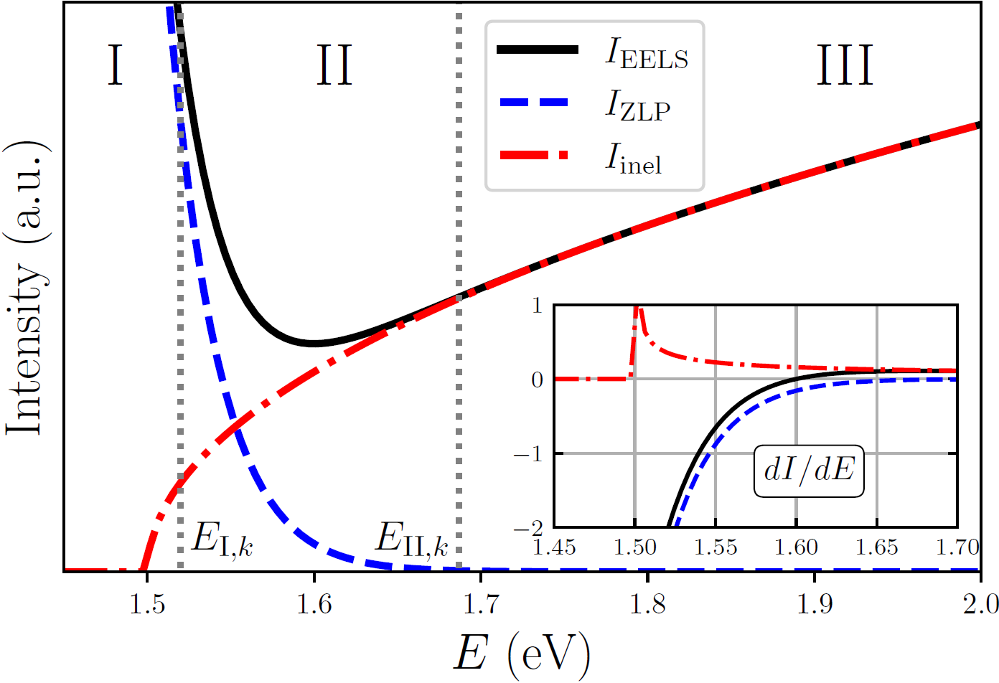

NN training
===========

Given that the zero-loss peak background cannot be evaluated from first
principles, in this work we deploy supervised machine learning combined
with Monte Carlo methods to construct a neural network parameterisation
of the ZLP. Within this approach, one can faithfully model the ZLP dependence
on both the electron energy loss and on the local specimen thickness. Our approach,
first presented in :cite:p:`Roest:2020kqy`, is here extended to model the thickness
dependence and to the simultaneous interpretation of the :math:`\mathcal{O}(10^4)` spectra
that constitute a typical EELS-SI. One key advantage is the robust estimate of the
uncertainties associated to the ZLP modelling and subtraction procedures using the
Monte Carlo replica method :cite:p:`DelDebbio:2007ee`.

.. _architecture:

.. figure:: figures/neuralnetwork.png
    :width: 90%
    :class: align-center
    :figwidth: 90%
    :figclass: align-center

    *The neural network architecture parametrising the ZLP. The input neurons are the
    energy loss* :math:`E` *and the logarithm of the integrated intensity* :math:`N_{\rm tot}` *, while
    the output neuron is the (logarithm of the) model prediction for the ZLP intensity.*

The neural network architecture adopted in this work is displayed in
:numref:`architecture`. It contains two input variables, namely the energy
loss :math:`E` and the logarithm of the integrated intensity :math:`\ln\left( N_{\rm tot}\right)`,
the latter providing a  proxy for the thickness :math:`t`. Both :math:`E` and :math:`\ln\left( N_{\rm tot}\right)`
are preprocessed and rescaled to lie between 0.1 and 0.9 before given as input to
the network. Three hidden layers contain 10, 15, and 5 neurons respectively. The
activation state of the output neuron in the last layer, :math:`\xi^{(n_L)}_1`, is then
related to the intensity of the ZLP as

.. math::

    I_{\rm ZLP}^{(\rm NN)}(E,\ln (N_{\rm tot}) ) =
    \exp\left( \xi^{(n_L)}_1( E, \ln ( N_{\rm tot})) \right) \, ,

where an exponential function is chosen to facilitate the learning, given that the
EELS intensities in the training dataset can vary by orders of magnitude. Sigmoid
activation functions are adopted for all layers except for a ReLU in the final layer,
to guarantee a positive-definite output of the network and hence of the predicted intensity.

The training of this neural network model for the ZLP is carried out as follows.
Assume that the input SI  has been  classified into :math:`K` clusters following the
procedure of App.~\ref{sec:processing-SI}. The members of each cluster exhibit a
similar value of the local thickness. Then one selects at random a representative
spectrum from each cluster,

.. math:: :label: eq:random_choice_spectra_app

    \left\{ I_{\rm EELS}^{(i_1,j_1)}(E),
    I_{\rm EELS}^{(i_2,j_2)}(E),\ldots,
    I_{\rm EELS}^{(i_K,j_K)}(E) \right\} \, ,

each one characterised by a different total integrated intensity evaluated from Eq.
:eq:`eq:total_integrated_intensity`,

.. math::

    \left\{
    N_{\rm tot}^{(i_1,j_1)},
    N_{\rm tot}^{(i_2,j_2)},\ldots,
    N_{\rm tot}^{(i_K,j_K)} \right\} \, ,

such that :math:`(i_k,j_k)` belongs to the :math:`k`-th cluster. To ensure that the neural network
model accounts only for the energy loss :math:`E` dependence in the region where the ZLP
dominates the recorded spectra, we remove from the training dataset those bins with
:math:`E \ge  E_{{\rm I},k}` with :math:`E_{{\rm I},k}` being a model hyperparameter :cite:p:`Roest:2020kqy`
which varies in each thickness cluster. The cost function :math:`C_{\rm ZLP}` used to train
the NN model is then

.. math:: :label: eq:costfunction_NNtraining_appendix

    C_{\rm ZLP} = \frac{1}{n_{E}}\sum_{k=1}^K \sum_{\ell_k=1}^{n_E^{(k)}} \frac{\left[
    I_{\rm EELS}^{(i_k,j_k)}(E_{\ell_k}) - I_{\rm ZLP}^{(\rm NN)} \left(
    E_{\ell_k},\ln \left( N_{\rm tot}^{(i_k,j_k)}\right) \right) \right]^2}{\sigma^2_k \left( E_{\ell_k}\right) } \, ,\qquad
    E_{\ell_k} \le E_{{\rm I},k} \, ,

where the total number of energy loss bins that enter the calculation is the
sum of bins in each individual spectrum, :math:`n_{E} = \sum_{k=1}^K n_E^{(k)} \, .`
The denominator of Eq. :eq:`eq:costfunction_NNtraining_appendix` is given by
:math:`\sigma_k \left( E_{\ell_k}\right)`, which represents the variance within the :math:`k`-th
cluster for a given value of the energy loss :math:`E_{\ell_k}`. This variance is evaluated
as the size of the 68\% confidence level (CL) interval of the intensities associated
to the :math:`k`-th cluster for a given value of :math:`E_{\ell_k}`.

For such a random choice of representative cluster spectra, Eq. :eq:`eq:random_choice_spectra_app`,
the parameters (weights and thresholds) of the neural network model are obtained
from the minimisationof :eq:`eq:costfunction_NNtraining_appendix` until a
suitable convergence criterion is achieved. Here this training is carried out using
stochastic gradient descent (SGD) as implemented in the {\tt PyTorch} library :cite:p:`NEURIPS2019_9015`,
specifically by means of the ADAM minimiser. The optimal training length is determined
by means of the look-back cross-validation stopping. In this method, the training data is
divided :math:`80\%/20\%`  into training and validation subsets, with the best training point
given by the absolute minimum of the validation cost function :math:`C_{\rm ZLP}^{(\rm val)}`
evaluated over a sufficiently large number of iterations.

In order to estimate and propagate uncertainties associated to the ZLP parametrisation
and subtraction procedure, here we adopt a variant of the Monte Carlo replica method :cite:p:`Roest:2020kqy`
benefiting from the high statistics (large number of pixels) provided by an EELS-SI.
The starting point is selecting :math:`N_{\rm rep}\simeq \mathcal{O}\left( 5000\right)` subsets of
spectra such as the one in Eq. :eq:`eq:random_choice_spectra_app` containing one
representative of each of the :math:`K` clusters considered. One denotes this subset of
spectra as a Monte Carlo (MC) replica, and we denote the collection of replicas by

.. math:: :label: eq:random_choice_spectra_v2

    {\boldsymbol I}^{(m)} = \left\{
    I_{\rm EELS}^{(i_{m,1},j_{m,1})}(E),
    I_{\rm EELS}^{(i_{m,2},j_{m,2})}(E),\ldots,
    I_{\rm EELS}^{(i_{m,K},j_{m,K})}(E) \right\} \, ,
    \quad m=1,\ldots,N_{\rm rep} \, .

where now the superindices :math:`(i_{m,k},j_{m,k})` indicate a specific spectrum from the
:math:`k`-th cluster that has been assigned to the :math:`m`-th replica. Given that these replicas
are selected at random, they provide a representation of the underlying probability
density in the space of EELS spectra, e.g. those spectra closer to the cluster mean will
be represented more frequently in the replica distribution.

.. _EELStoyfig:

    *Schematic representation of the ZLP and inelastic scattering contributions adding
    up to the total EELS intensity within a toy simulation. We indicate the values
    of the hyperparameters* :math:`E_{{\rm I},k}` *and* :math:`E_{{\rm II},k}` *for such configuration:
    the neural network model for the ZLP is trained on the data corresponding to region I
    (hence* :math:`E\le E_{{\rm I},k}` *), while the behaviour in region II is determined purely
    from model predictions. The inset displays the first derivative of each of the three curves.*

By training now a separate model to each of the :math:`N_{\rm rep}` replicas, one ends up
with another Monte Carlo representation, now of the probability density in the space
of ZLP parametrisations. This is done by replacing the cost function
:eq:`eq:costfunction_NNtraining`

.. math:: :label: eq:costfunction_NNtraining

    C_{\rm ZLP}({\boldsymbol \theta}) \propto \sum_{k=1}^K \sum_{\ell_k=1}^{n_E^{(k)}} \frac{\left[
    I^{(i_k,j_k)}(E_{\ell_k}) - I_{\rm ZLP}^{(\rm NN)} \left(
    E_{\ell_k},\ln \left( N_{\rm tot}^{(i_k,j_k)}\right) ;{\boldsymbol \theta}\right) \right]^2}{\sigma^2_k \left(
    E_{\ell_k}\right) } \, ,\qquad E_{\ell_k} \le E_{{\rm I},k} \, ,

by

.. math:: :label: eq:costfunction_NNtraining_v2

    C_{\rm ZLP}^{(m)} = \frac{1}{n_{E}}\sum_{k=1}^K \sum_{\ell_k=1}^{n_E^{(k)}} \frac{\left[
    I_{\rm EELS}^{(i_{m,k},j_{m,k})}(E_{\ell_k}) -
    I_{\rm ZLP}^{({\rm NN})(m)} \left(
    E_{\ell_k},\ln \left( N_{\rm tot}^{(i_{m,k},j_{m,k})}\right) \right) \right]^2}{\sigma^2_k \left(
    E_{\ell_k}\right) }  \, , \qquad E_{\ell_k} \le E_{{\rm I},k} \, ,

and then performing the model training separately for each individual replica. Note
that the denominator of the cost function Eq. :eq:`eq:costfunction_NNtraining_v2` is
independent of the replica. The resulting Monte Carlo distribution of ZLP models, indicated by

.. math:: :label: eq:random_choice_spectra_v6

    {\boldsymbol I}_{\rm ZLP}^{(\rm NN)} = \left\{
    I_{\rm ZLP}^{({\rm NN})(1)} \left(E,\ln \left( N_{\rm tot} \right)\right), \ldots,
    I_{\rm ZLP}^{({\rm NN})(N_{\rm rep})} \left(E,\ln \left( N_{\rm tot} \right)\right) \right\}

makes possible subtracting the ZLP from the measured EELS spectra following the
matching procedure described in :cite:p:`Roest:2020kqy` and hence  isolating the inelastic
contribution in each pixel,

.. math::

    I_{\rm inel}^{(i,j)(m)}(E) \simeq \left[ I^{(i,j)}_{\rm EELS}(E) -
    I_{\rm ZLP}^{({\rm NN})(m)} \left( E,\ln \left( N_{\rm tot}^{(i,j)}
    \right) \right) \right] \, ,\quad m=1,\ldots,N_{\rm rep}  \, .

The variance of :math:`I_{\rm inel}^{(i,j)}(E)` over the MC replica sample estimates the
uncertainties associated to the ZLP subtraction procedure. By means of these MC samplings
of the  probability distributions associated to the ZLP and inelastic components of the
recorded spectra, one can evaluate the relevant derived quantities with a faithful error
estimate. Note that in our approach error propagation is realised without the need to resort
to any approximation, e.g. linear error analysis.

One important benefit of Eq. :eq:`eq:costfunction_NNtraining_v2` is that the machine learning
model training can be carried out fully in parallel, rather than sequentially, for each replica.
Hence our approach is most efficiently implemented when running on a computer cluster
with a large number of CPU (or GPU) nodes, since this configuration maximally exploits
the parallelization flexibility of the Monte Carlo replica method.

As mentioned above, the cluster-dependent hyperparameters :math:`E_{{\rm I},k}` ensure that the
model is trained only in the  energy loss data region where ZLP dominates total intensity.
This is illustrated by the scheme of :numref:`EELStoyfig`, showing a toy simulation of
the ZLP and inelastic scattering contributions adding up to the total recorded EELS intensity.
The neural network model for the ZLP is then trained on the data corresponding to region I,
while region II is obtained entirely from model predictions. To determine the values of
:math:`E_{{\rm I},k}`, we evaluate the first derivative of the total recording intensity,
:math:`dI_{\rm EELS}(E)/dE`, for each of the members of the :math:`k`-th cluster. When this derivative
crosses zero, the contribution from :math:`I_{\rm inel}` will already be dominant. There are then
two options. First, one sets :math:`E_{{\rm I},k} = f \times E_{{\rm min},k}`, where :math:`f < 1`
and :math:`E_{{\rm min},k}` is the energy where the median of :math:`dI_{\rm EELS}/dE` crosses zero
(first local minimum) for cluster :math:`k`. Second, one sets :math:`E_{{\rm I},k}` to be  the value
where at most :math:`f\%` of the models have crossed :math:`dI_{\rm EELS}/dE=0`, with :math:`f\simeq 10\%`.
This choice implies that 90\% of the models still exhibit a negative derivative. We have
verified that compatible results are obtained with the two choices, indicating that results
are reasonably stable with respect to the value of the hyperparameter :math:`E_{{\rm I},k}`.

The second model hyperparameter, denoted by :math:`E_{{\rm II},k}` in :numref:`EELStoyfig`,
indicates the region for which the ZLP can be considered as fully negligible. Hence in
this region III we impose that :math:`I_{\rm ZLP}(E)\to 0` by means of the Lagrange multiplier
method. This condition fixes the model behaviour in the large energy loss limit, which
otherwise would remain unconstrained. Since the ZLP is known to be a steeply-falling
function, :math:`E_{{\rm II},k}` should not chosen not too far from :math:`E_{{\rm I},k}` to avoid
an excessive interpolation region. In this work we use :math:`E_{{\rm II},k}=3\times E_{{\rm I},k}`,
though this choice can be adjusted by the user.

Finally, we mention that the model hyperparameters :math:`E_{{\rm I},k}` and :math:`E_{{\rm II},k}`
could eventually be determined by means of an automated hyper-optimisation procedure as
proposed in :cite:p:`ball2021path`, hence further reducing the need for human-specific input
in the whole procedure.